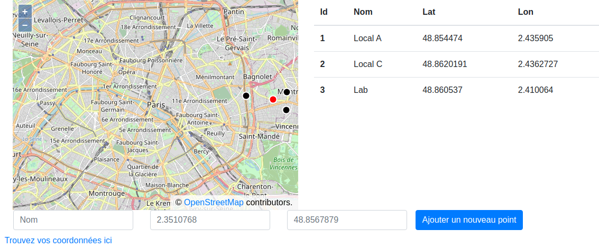

# js-markers-map

Un projet simple pour afficher le barycentre de plusieurs points sur une carte Open Street Map :



## Installation des modules node :

```bash
npm install
```

## Lancement de l'application :

```bash
npm start
```

Puis lancer le lien dans un navigateur (par defaut : [http://localhost:1234/](http://localhost:1234/))

